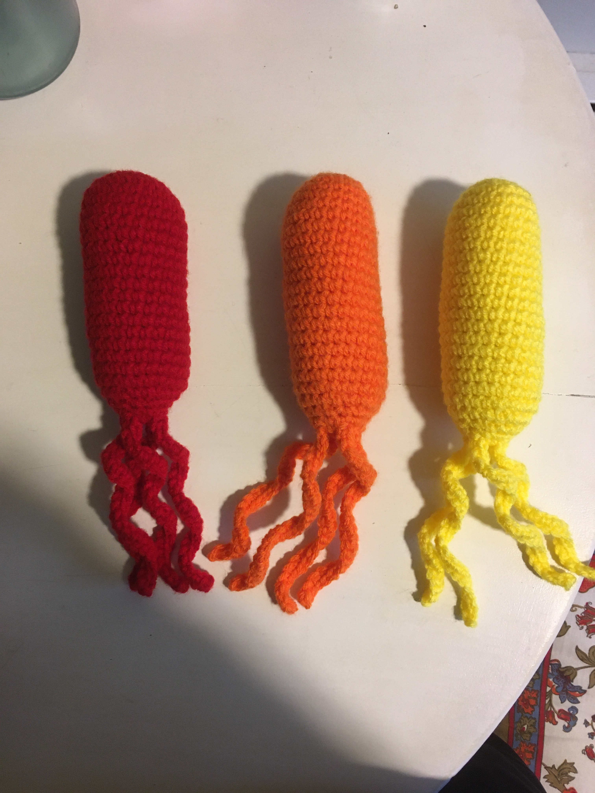

# Undergraduate and Graduate Education

In 2018, I graduated *summa cum laude* from the University of Tulsa with a Bachelor's of Science in Chemical Engineering with a Pre-Medicine Emphasis. After the summer, I moved from Oklahoma to Massachusetts for graduate school at the University of Massachusetts Amherst for a PhD in Chemical Engineering. Shortly thereafter, I joined Lauren Andrew's Lab, which focuses on synthetic biology and genetic engineering, especially through high-throughput methods.

# Research

My project focuses on the elucidation of gene associated with cell attachment, biofilm formation, and antibiotic resistance in both *E. coli* and *S. aureus*. *E. coli* is the most common cause of catheter-associated urinary tract infections, which account for the greatest number of hospital-acquired infections, while *S. aureus* is the most common cause of extremely dangerous catheter-associated bloodstream infections. These biofilm infections are extremely resilient and difficult to treat, due in part to greatly increased antibiotic resistance. Additionally, the broad-spectrum antibiotics commonly used to try to treat these biofilm infections are contributing to the development of antibiotic-resistant microbes in hospitals and the community. My aim is to find genes associated with cell attachment and biofilm formation on relevant biomaterials and genes associated with increased antibiotic resistance of these attached bacteria to relevant antibiotics. These genes may provide effective genetic targets for the design of targeted antimicrobials, such as peptide nucleic acids, that could specifically target just pathogenic bacteria to prevent and treat biofilm infections while decreasing the chance of the development of antibiotic resistance in the general microbial population.

To elucidate these genes, I am using CRISPR interference, or CRISPRi, to repress all native genes in the genomes of *E. coli* MG1655 and *S. aureus* ATCC 12600. I have been characterizing the dCas9 CRISPRi tool I created for MG1655 to determine the design rules needed to effectively repress gene expression. For ATCC 12600, I have been building and characterizing a genetic part library for *S. aureus* because the literature reports very few synthetic genetic parts for this organism, with no compiled "toolbox" of various genetic parts all characterized in a standard way. After creating this genetic parts library, I can then build and characterize a dCas12a CRISPRi tool for ATCC 12600 as I did for MG1655. 

![CRISPRi is a simple way to specifically target and strongly repress gene expression. The only required components to target a gene is a Protospacer Adjacent Motif (PAM) adjacent to the target site, homology with the 20 nucleotide target sequence, and expression of the single guide RNA (sgRNA) and dCas protein. Additionally, care must be taken to prevent off-target effects and overexpression of the dCas protein. This is easily done through the efficient design of the sgRNA and characterization of the CRISPRi tool, respectively.](images/dCas9Binding.png)

Soon, I will design genome-wide guide RNA pools to systematically target nearly every gene, ideally with at least 10 designs per gene, using the design rules for each CRISPR system. I will then use a pooled competitive attachment assay to measure how the repression of certain genes affects the attachment of bacteria to a range of biomaterials of different compositions, hydrophilicities, and stiffnesses, as these factors have been shown to affect bacterial attachment and biofilm formation. These biomaterials will be created and characterized by our collaborators at the Schiffman Lab here at the University. 

![Overview of the attachment assay experiment to uncover cell attachment and biofilm formation genes. The guide RNAs will be designed to minimize off-target effects and maximize repression. The library will be synthesized as an oligo pool and then assembled and inserted into the bacteira using high efficiency methods to minimize loss of designs. The attachment assay will be performed over varying lengths of time to study both initial cell attachment and mature biofilm formation. Next generation sequencing will be used to determine the frequency of each sgRNA design before and after the attachment assay, which will be used to determine the genes associated with biofilm formation via the absolute change in frequency.](images/CRISPRi_overview.png)

After determining the top genes most associated with promoting and inhibiting cell attachment and biofilm formation through the competitive attachment assay, I will investigate the binary genetic interactions (epistasis) between a subset of these genes by inhibiting two genes at once and performing the same attachment assay. The combinations that inhibit cell attachment and/or biofilm formation the most could be effective targets for the design of targeted antimicrobials. 

After investigating cell attachment and biofilm formation genes, I will be performing an antibiotic attachment assay using clinically-relevant antibiotics to determine the genes most associated with antibiotic resistance of attached bacteria. Like for the biofilm formation genes, I will then investigate the genetic interactions between the a subset of genes associated with antibiotic resistance as I will with the cell attachment and biofilm formation genes.

![Overview of the combinatorial attachment assay with antibiotics to determine antibiotic resistance genes. The procedure for this assay is the same as before except that the plasmid library will be assembled with two sgRNA designs for simultaneous repression of two genes. In the case of the antibiotic combinatorial attachment assay, a clinically-relevant antibiotic is present in the media above the biomaterial. The attachment assay to determine cell attachment and biofilm formation genes is the same except without the antibiotic present in the media. ](images/CRISPRi_overview_epistasis.png)

# Research Interests

My research interests include synthetic biology, genetic engineering, mathematical modeling, bioinformatics, chemistry, and kinetics. I find it incredible and amazing that life exists and is controlled by so many chemical reactions happening simultaneously within a cell and how all the information needed to run and control these chemical reactions are encoded within DNA. I also like how we can harness these cells to produce non-native products or change their behavior/function by simply introducing additional DNA in the form of designed synthetic genes. I can use bioinformatics to, for example, investigate how the genome is affected by introduction of a foreign gene or search for patterns in gene expression under different conditions. (I also really like programming).

On a related note, I enjoy mathematical modeling of both life processes (e.g., the binding and unbinding of transcription factors to DNA or the prediction of the translation initiation rate of a gene based on the 5' untranslated region sequence) and non-life processes (e.g., reaction kinetics of a chemical process or the dynamic response of an electrical circuit to the introduction of a pulsed voltage).  Preferably, these models would be derived from first principles, such as the Laws of Thermodynamics or statistical mechanics, not simply black-box models. It's incredible that we can use numbers and mathematics, both arbitrary human constructs, to accurately predict the outcome of a situation based on known parameters. 

Finally, I also enjoy chemistry and kinetics. I am amazed how a new matter with different and new properties can be made from other matter through chemical reactions. In conjunction with mathematical modeling, I enjoy investigating the kinetics of these chemical reactions and trying to figure out what is happening on the molecular level when these reactions occur, such as the movement of electrons, molecular mechanisms, and more. 

# Other Interests

Besides conducting research, I have many other interests and hobbies. The most prominent is my love of rowing and working out in general. With no prior experience on a competitive sports team, I joined the University of Tulsa's Women's Rowing Team my freshman year of undergraduate school and soon developed a strong passion for the sport and physical activity. My boat even won a gold medal at the Conference Championships my Sophomore year. I have continued a strict training regimen since graduating from the University of Tulsa, and I joined a local competitive rowing club in Northampton and continue to race at local and regional regattas. Although I don't row as much due to the time, money, and weather constraints, I instead cycle indoors on a magnetic spin bike I bought for personal use or run when I can. I hope to one day complete a full Ironman within the top 20% of finishers.

   

My other hobbies and interests include video games, programming, and crocheting. Some of my favorite video game franchises include Minecraft, the original Spyro trilogy, Pokemon, and Assassin's Creed.

I recently gained an interest in programming after teaching myself Python over the first few months of quarantine at the beginning of this global pandemic. I enjoy how I can customize and create my own code, both for work and to modify video games like Minecraft. It's especially satisfying to create a script that automates data analysis, like my flow cytometry data. I have even created custom scripts for my lab.

[I currently know how to program in Python and R, and I've been using these languages to make scripts. I also know a little about Java because Minecraft is written in Java and it is easy (and common) to modify the game, including through a command line in-game.](images/python_r.jpg)

When I have the time, I also love to crochet. I like to make scarves and hats with a variety of different stitches and patterns for warmth in the wintertime. Additionally, I love to crochet amigurumi, which are small and typically cute stuffed toys like dogs and cats, and larger stuffed toys.

